\page contactoverview Overview of contact, slip, and friction

This tutorial provides an overview of simplifying assumptions, approximations,
and numerical models used in simulation of contact, slip, and friction in
Gazebo.

## Prerequisites

- \ref physicsconcepts "Physics concepts"

## Conceptual definitions

- **Contact** occurs when two objects are touching.

    - Illustration of shapes touching: a long box touching a smaller box and a circle, and two circles touching each other.

    - 

- **Slip** is a measure of relative motion along the surface of contacting objects.
  It can have units of meters/second for translational slip or radians/second
  for rotational slip.

    - Illustration of shapes touching without slip: two stationary boxes, a circle rolling on top of a stationary box, and two circles rolling against each other.

    - 

    - Illustration of shapes touching with slip: a box sliding along the surface of a longer box, a circle sliding and counter-rotating on top of a stationary box, and a circle sninning in place on top of a stationary circle.

    - 

<!-- illustrate torsional slip? -->

- **Friction** is a physical effect that restricts slip. Friction causes a
  force to restrict translational slip and a torque to restrict rotational
  slip. Friction can both act to reduce existing slip and to prevent slip from
  occurring.

    - Illustration of a box at rest on an inclined surface with downward
      gravity and a friction force between the box and inclined surface that
      holds the box in place.

    - Illustration of a sliding box and a circle rolling with slip and
      friction forces opposing the slip.

## Contact simulation

### Approximations for a mathematical model

- Object shapes are non-deformable
- Volumetric overlap / interpenetration of shapes is allowed

    - Illustration of overlapping boxes and spheres.

- Contact between a pair of objects is represented by a set of contact points,
  which must be inside or on the surface of both objects.

    - Illustration of contact points for overlapping boxes and spheres.
    <!--
      Sphere-sphere: one point
      Sphere-box face: one point
      Box face-box face: two points?
    -->

- A normal direction is defined for each contact point. The plane orthogonal
  to the normal direction that passes through the contact point is defined as
  the contact tangent plane.

    - Illustration of contact normals / tangent planes for overlapping boxes and spheres.
    - Illustration of contact coordinate frame from Open Dynamics Engine manual
    - 

- Contact depth is defined as the distance from a contact point to the surface,
  with the following sign convention:

    - depth > 0 :: inside the object

    - depth = 0 :: on surface of the object

    - depth < 0 :: outside the object

- The process of computing contact points for a pair of objects is often called
  **collision checking**.

#### Commentary on contact point approximation / collision checking

- Computational cost
    - Checking for collisions between `N` objects requires checking `O(N^2)` pairs
      of shapes, which can be computationally expensive.
    - A common trick to reduce this computational burden is to approximate each
      shape with an axis-aligned bounding box (AABB) and check pairs of the AABB
      shapes for overlap. This is a **broadphase collision check**, which can
      quickly rule out collisions between pairs of objects that are far apart.
      For objects whose AABB approximations overlap, a more accurate **narrowphase
      collision check** is performed, which computes contact points.
- Uniqueness, quality

### Numerical representation of contact

A numerical constraint for each contact point is enforced at each timestep to
limit contact depth.

- The constraint force `F_N` acts along the normal direction.
- The constraint is unilateral:

  depth < 0 ==> `F_N` = 0

  `F_N` > 0 ==> depth >= 0

- Constraint relaxation parameters allow tuning the relationship between normal
  force and depth (see the
  [Soft Constraints presentation at GDC2011](https://box2d.org/files/ErinCatto_SoftConstraints_GDC2011.pdf)
  for a good discussion of the ERP and CFM constraint relaxation parameters
  and how they map to linear stiffness `kp` and damping `kd` parameters).
  Some parameters used by the Open Dynamics Engine in Gazebo-Classic include
  the `kp`, `kd`, `min_depth`, and `max_vel` parameters in
  [//surface/contact](http://sdformat.org/spec?ver=1.11&elem=collision#surface_contact)
  (see also the Physics parameters tutorial for Gazebo Classic).
- The contact depth is analogous to sinkage in deformable terrain but is not
  computed from a terramechanics model.

## Slip calculation

- Translational slip is computed at each contact point as follows:
    - Compute the linear velocity of each shape at the contact point.
    - Compute the relative linear velocity as the difference between the
      velocity of each shape.
    - Compute the projection into the contact tangent plane of the relative
      linear velocity at the contact point.
    - The translational slip is the relative linear velocity with units of
      `m/s` projected into the contact tangent plane.
- Torsional slip is computed at each contact point as follows:
    - Compute the angular velocity of each shape.
    - Compute the relative angular velocity as the difference of these
      velocities.
    - The rotational slip is the relative angular velocity component parallel
      to the normal direction with units of `rad/s`.
- When simulating wheels, it is common to use a nondimensional measure of slip.
  This will be detailed in a later section focusing specifically on simulation
  of wheels in contact.

## Friction simulation

### Assumptions for mathematical model of friction

- Friction causes a force `F_f` to act in the contact tangent plane that
  opposes the slip velocity `v_s`.

  `F_f * v_s <= 0`

- Friction is dissipative, removes energy from a system.
- Friction force magnitude is limited and proportional to the contact normal
  force. A geometric interpretation of this relationship is the "friction
  cone" concept.
    - Illustration of friction cone from Open Dynamics Engine manual.
    - 

### Approximations for mathematical model of friction

- Friction behavior in the two dimensions of the contact tangent plane can be
  decoupled and computed independently along two "friction directions."
  This is known as the "friction pyramid" approximation of the more general
  "friction cone" model.
  By choosing the "first friction direction," the second direction is implied.

  `t_2 = n \cross t_1`

    - Illustration of contact coordinate frame with friction directions from Open Dynamics Engine manual
    - 

- There are several options when choosing friction directions:
    - Aligned with the slip velocity. This has the advantage of reproducing
      the "friction cone" behavior, but is undefined for objects at rest.
    - Fixed to a rigid body frame. This is useful for bodies with distinct
      anisotropic friction behavior (such as the longitudinal and lateral
      friction behavior of pneumatic tires or for
      [simulation of omni-directional Mecanum wheels](https://github.com/gazebosim/gz-sim/blob/gz-sim8/examples/worlds/mecanum_drive.sdf)),
      but more logic is required to
      determine which body-fixed frame to use if two objects come into
      contact that each prefer to use a friction direction defined in their
      own body-fixed frames.
    - The corner cases of the previous two approaches can be avoided by
      aligning the friction directions with a fixed frame. This is logically
      simpler and is the default behavior in gazebo-classic for this reason,
      though it has known limitations (see the
      [comparison of boxes sliding with pyramid vs cone friction](https://classic.gazebosim.org/tutorials?tut=physics_params&cat=physics#Frictionparameters)).

### Numerical representation of friction

A numerical constraint for each friction direction is enforced at each timestep
to limit slip.

- The constraint force magnitude in each friction direction is limited by the
  normal force and a friction coefficient.

  `-µ F_N <= F_f <= µ F_N`

- The constraint force attempts to drive the slip velocity to zero.
  Constraint relaxation parameters allow tuning the friction response.

~~~
  | friction force (N)
  |
--+-------------------------- slip (m/s)
  |\
  | \
  |  \
  |   \-┐ slope is inverse of
  |    \| slip compliance
  |     \
  |      ----------------- maximum friction force
~~~

<!-- plot showing effect of slip compliance -->
