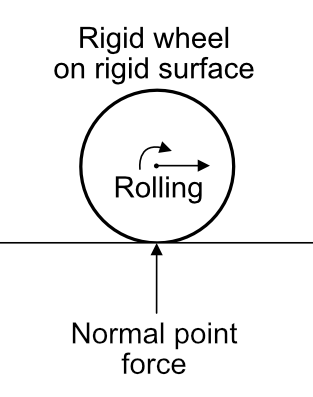
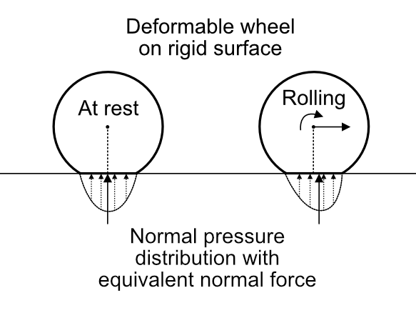
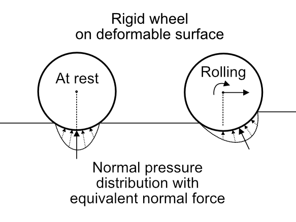

\page wheelcontact Simulating wheel-terrain contact

This tutorial expands on the overview of contact, slip and friction with special
considerations for simulating wheel-terrain contact in Gazebo.

## Prerequisites

- \ref contactoverview "Overview of contact, slip, and friction"

## Contact simulation: special considerations for wheels and terrain

### Choosing a wheel collision shape

One can choose a cylinder, ellipsoid, sphere or triangle mesh for a wheel
collision shape. Keys to consider are:

- The actual shape of the wheel you are trying to model
- The quality of contact points that will be generated with the chosen terrain
  shape

For example with a heightmap terrain shape in Gazebo-Classic using
Open Dynamics Engine (ODE), there are known issues
([odedevs/ode#71](https://bitbucket.org/odedevs/ode/issues/71/small-spheres-fall-through-convex-edges-of)
and [gazebo-classic#684](https://github.com/gazebosim/gazebo-classic/issues/684))
with all of the mentioned wheel shapes, but for spheres and heightmaps,
the issue of a sphere falling though a convex edge can be avoided if the
radius of the sphere is larger than the resolution of the heightmap grid.

- Computational complexity of collision checking (primitive shape vs mesh
  with many triangles)

### Choosing a terrain collision shape

- For flat terrain, a combination of boxes and a ground plane can be used,
  which are simple and will have reasonable contact points.
- For more general 3-D terrain surfaces, a triangle mesh is the most flexible,
  though the collision checkers provided by different physics engines vary in
  the quality and number of contact points generated for triangle meshes.
- A heightmap can be used to model a 2.5-D surface, which is defined by a set
  of elevations over a regularly-spaced 2-D grid of points. A heightmap has some
  advantages in collision checking compared to a triangle mesh, since it only
  needs to check for collisions over the portion of the heightmap covered by
  the other object's AABB. Despite this efficiency, there may be issues with
  the contact points generated with a heightmap, such as those noted in
  [odedevs/ode#71](https://bitbucket.org/odedevs/ode/issues/71/small-spheres-fall-through-convex-edges-of)
  and [gazebo-classic#684](https://github.com/gazebosim/gazebo-classic/issues/684).

### Contact pressure distributions

As mentioned in \ref contactoverview, Gazebo simulates contact with overlap of
nondeformable shapes, while in reality objects do deform when they touch,
creating contact patches with surface pressure and shear stress.
Contact points can approximate a contact patch well if placed at
the center of pressure. This section discusses how wheel and terrain
deformability affect contact patch properties and how well contact points can
approximate these contact patches. These examples currently focus on
longitudinal dynamics.

#### Rigid wheel on rigid terrain

As a baseline, consider a rigid wheel resting on a flat rigid surface at a
single point. The contact patch in this idealized case is a single point.
An illustration is provided in the figure below.

#### Deformable wheel on rigid terrain

Now consider a deformable wheel (such as a wheel with a pneumatic tire) in
contact with a flat rigid terrain surface.
Rather than contacting at a single point, the bottom of the tire deforms to
create a flat contact patch.
At rest, the contact patch may have a symmetric distribution of normal contact
pressure, such that the center of pressure is directly below the wheel center,
as illustrated in the left portion of the figure below.
While rolling, the wheel deformation may "bunch up" in the direction of travel
(due to [hysteresis of the material](https://en.wikipedia.org/wiki/Rolling_resistance))
and bias the contact pressure distribution, such that the center of pressure
is in front of the wheel center, generating a rolling resistance torque.
The illustration below shows a deformable wheel at rest and a wheel rolling.

The rolling resistance torque can be modeled numerically as a friction
constraint, though it is not yet supported in Gazebo (see
[gazebo-classic#3084](https://github.com/gazebosim/gazebo-classic/issues/3084)).
The change in the height of the wheel above the terrain can be modeled using
the linear stiffness (`kp`) and linear damping (`kd`) parameters in the SDFormat
[//surface/contact](http://sdformat.org/spec?ver=1.11&elem=collision#surface_contact)
element.

#### Rigid wheel on deformable terrain

Now consider a rigid wheel in contact with a deformable terrain surface
(such as sand or a soft soil).
At rest, the wheel may sink into the surface with a symmetric distribution of
normal contact pressure, such that the center of pressure is directly below
the wheel center, as illustrated in the left portion of the figure below.
While rolling, the sinkage of the wheel may cause a plowing effect, in which
the terrain material is bunched up in the direction of travel and compacted
in its wake.
This can cause a significant forward bias in the distribution of normal contact
pressure and an equivalent normal force vector that is inclined relative to the
undisturbed surface normal.
In the right portion of the illustration below, the equivalent normal force
opposes the motion of the wheel, requiring travtive torque to be applied in
order to maintain a steady velocity.
Even when flat, this plowing effect can make driving on a deformable surface
energetically equivalent to driving uphill on a rigid surface.

This longitudinal plowing effect has been approximated in Gazebo Classic by
displacing contact points and inclining the contact normals to replicate the
behavior shown in the right side of the figure above (see Gazebo Classic
[issue #3085](https://github.com/gazebosim/gazebo-classic/issues/3085) and
[pull request #3164](https://github.com/gazebosim/gazebo-classic/pull/3164)).
To enable the plowing effect, custom SDFormat tags must be added to the
terrain collision (`//collision/gz:plowing_terrain`) and the wheel collisions
(`//collision/gz:plowing_wheel`), and the wheel collisions must specify a
body-fixed friction direction in the wheel's lateral direction with the
[`//collision/surface/friction/ode/fdir1` SDFormat parameter](http://sdformat.org/spec?ver=1.11&elem=collision#ode_fdir1).

Figure showing displacement of contact points and inclination of normal direction
by a constant angle

Figure plotting plowing angle as a saturated linear function of the
longitudinal linear speed of the wheel center.

## Slip calculation for wheels

From the Overview of contact, slip, and friction documentation, slip is defined
as a measure of relative motion along the surface of contacting objects with
units of [m/s] for translational slip or [rad/s] for rotational / torsional
slip.
When simulating wheel-terrain contact, it is common to use a nondimensional
representation of slip and to compute slip differently along the rolling
direction (also known as the longitudinal direction) and the non-rolling
lateral direction.

### Definition of wheel directions and wheel contact coordinate frame

The longitudinal direction of a wheel can be loosely defined as the
"rolling direction" of the wheel and the lateral direction as "parallel to
the wheel's rolling axis."
The axes can be defined mathematically for a wheel in contact with terrain
as follows:

<!-- need a figure illustrating a wheel with these terms -->

* Define `W` as the center of a wheel with radius `R`.
* Define `w` as the body-fixed axis about which the wheel rotates
  (typically an axis of symmetry) with rotational speed `ω`.
* At each contact point `C` with normal direction `n`, define a wheel contact
  coordinate frame whose origin is `C` and one of the axes is `n`.
  If `w` is not parallel to `n`, then the lateral wheel contact direction
  `t_lat` is defined by projecting `w` into the contact tangent plane of `C`
  and normalizing to unit length. The longitudinal wheel contact direction
  `t_lon` is then computed directly as `t_lon = n \cross t_lat`.
* The wheel contact coordinate frame has its origin at `C` with orthogonal
  axis directions `n`, `t_lat`, and `t_lon`.

The translational slip at `C` in units of `m/s` is given as `v_t`, with
components in each tangent plane direction defined as:

Quantity                    | Variable name
--------------------------- | -------------
Longitudinal slip velocity  | `v_t,lon`
Lateral slip velocity       | `v_t,lat`

### Definition of nondimensional longitudinal wheel slip

The longitudinal slip velocity is nondimensionalized by dividing by one of two
measured velocities, depending on the slip condition.
For illustration, consider the case when the wheel center `W` lies a distance
`R` from the contact point `C` along normal direction `n` (typical of contact
with a flat surface).
In this case, the longitudinal slip velocity can be expressed as the difference
between the longitudinal wheel center velocity and the linear "spin speed" of
the wheel `v_t,lon = v_W,lon - R*ω`.

In Yoshida and Hamano, 2002
(DOI: [10.1109/ROBOT.2002.1013712](https://dx.doi.org/10.1109/ROBOT.2002.1013712)),
the two slip conditions used for defining nondimensional longitudinal wheel
slip are

Speed comparison  | Interpretation
----------------- | ------------------------
`R * ω > v_W,lon` | the wheel is spinning faster than its translational speed and is accelerating.
`R * ω < v_W,lon` | the wheel is spinning slower than its translational speed and is braking.

Nondimensional longitudinal wheel slip `s_a` and `s_b` are defined as follows
for each slip condition:

Rolling case  | Slip definition
------------- | ---------------
Accelerating  | `s_a = (R * ω - v_W,lon) / (R * ω)`
Braking       | `s_b = (R * ω - v_W,lon) / (v_W,lon)`

In each case, the numerator is the negative of longitudinal slip velocity
`-v_t,lon`.

When the wheel is rolling without slip (`v_t,lon = 0`), the longitudinal wheel
center velocity matches the linear "spin speed" `v_W,lon = R * ω` and
`s_a = s_b = 0`.

During acceleration, if the wheel is turning (`ω > 0`) but is not producing any
forward motion relative to the ground (`v_W,lon = 0`), then `s_a = 1`.

During braking, if the brakes are fully engaged(`ω = 0`) but the wheel keeps
moving forward (`v_W,lon > 0`), then `s_b = -1`.

Both nondimensional slip definitions `s_a` and `s_b` are in the interval
`[-1, 1]` for the speed conditions defined above, provided
that `R * ω` and `v_W,lon` are both positive.
The definition of `s_a` and `s_b` can be generalized to account for driving in
reverse as follows:

Rolling case | Speed comparison             | Slip definition
------------ | ---------------------------- | ---------------
Accelerating | `abs(R * ω) > abs(v_W,lon)`  | `s_a = (R * ω - v_W,lon) / (R * ω)`
Braking      | `abs(R * ω) < abs(v_W,lon)`  | `s_b = (R * ω - v_W,lon) / (v_W,lon)`

With these generalized speed conditions,
the nondimensional longitudinal slip values are in the interval [-1, 1] provided
that `R * ω` and `v_W,lon` have the same sign (`R * ω * v_W,lon >= 0`).
However when the velocity values have different signs,
the magnitude of `s_a` or `s_b` is
greater than 1. For example, when attempting to drive up a steep slope with
`R * ω > 0`, if the vehicle actually slides backwards with `v_W,lon < 0`, the
slip value `s_a` will be greater than 1.

### Definition of nondimensional lateral wheel slip

The lateral slip velocity is represented in nondimensional form by projecting
the wheel center velocity into the contact tangent plane and computing the angle
α between the projected velocity vector and the longitudinal wheel contact
direction: `α = arctan(v_W,lat / v_W,lon)`.

## Friction modeling for wheels

When simulating wheel-terrain contact and friction, it is common to model
wheel-terrain friction forces acting in the longitudinal and lateral wheel
directions as functions of the nondimensional slip variables `s` and `α`.
See Brach & Brach, 2009 (DOI: [10.4271/2009-01-0102](https://dx.doi.org/10.4271/2009-01-0102))
for an example of use in tire modeling for accident reconstruction and
Yoshida and Hamano, 2002
(DOI: [10.1109/ROBOT.2002.1013712](https://dx.doi.org/10.1109/ROBOT.2002.1013712))
for an example in modeling tire-soil interaction of interplanetary rovers.

### Wheel-fixed friction directions

To specify wheel-fixed friction directions in the longitudinal and lateral
directions, follow the approach used to define the longitudinal and lateral
directions in the wheel contact coordinate frame by setting the `fdir1`
parameter to be parallel to the revolute joint axis corresponding to the wheel
axle. With this approach, specify lateral friction / slip parameters in first
friction direction and longitudinal parameters in 2nd direction.

### Nondimensional saturated linear friction model with WheelSlipPlugin / WheelSlip system

Since the slip compliance parameters used by Gazebo's physics engines apply
forces based on slip velocity rather than nondimensional slip, Gazebo's
wheel slip plugin ([WheelSlipPlugin](https://github.com/gazebosim/gazebo-classic/blob/gazebo11/plugins/WheelSlipPlugin.hh)
in gazebo-classic and the [WheelSlip system](https://github.com/gazebosim/gz-sim/blob/gz-sim8/src/systems/wheel_slip/WheelSlip.hh)
in gz-sim have been written to dynamically update the dimensional slip
compliance parameters to emulate the use of nondimensional slip.

Recall from \ref contactoverview the relaxed model of friction force
as a piecewise linear function of slip velocity:

Friction force model          | Domain
----------------------------- | -------------------------------
`T = -v_t / slip_compliance`  | `∀ abs(v_t) ≤ µN * slip_compliance`
`T = -µN sgn(v_t)`            | `∀ abs(v_t) > µN * slip_compliance`

This model applies for each direction of the friction pyramid and can be tuned
with Gazebo parameters for the friction coefficient `µ` (unitless) and slip
compliance (units of `m/s/N`).

Given a nondimensional slip compliance parameter `unitless_slip_compliance`
and an estimate of the contact normal force `N_est`, these plugins
update the `slip_compliance` parameter at each time step as
`slip_compliance = unitless_slip_compliance * R * |ω| / N_est`.
This changes the linear portion of the friction model to a linear relation
between the tangential force ratio `T / N_est` and the nondimensional slip
during acceleration `s_a`:

Friction force model                                | Domain
--------------------------------------------------- | ---------------------------
`T/N_est = -s_a sgn(ω) / unitless_slip_compliance`  | `∀ abs(s_a) ≤ µN/N_est * unitless_slip_compliance`
`T/N_est = -µN/N_est sgn(v_t)`                      | `∀ abs(s_a) > µN/N_est * unitless_slip_compliance`

The quantity `s_a sgn(w)` is equivalent to `(R * ω - v_W,lon) / (R * abs(ω))`.
Defining this slip quantity as `S_a = (R * ω - v_W,lon) / (R * abs(ω))`,
the friction forces can be rewritten as:

Friction force model                        | Domain
------------------------------------------- | ---------------------------
`T/N_est = -S_a / unitless_slip_compliance` | `∀ abs(S_a) ≤ µN/N_est * unitless_slip_compliance`
`T/N_est = -µN/N_est sgn(S_a)`              | `∀ abs(S_a) > µN/N_est * unitless_slip_compliance`

Though it is common in the literature to define friction forces based on the
dual definitions of slip `s_a` and `s_b` depending on the speed conditions,
these plugins exclusively use the modified nondimensional slip value under
acceleration `S_a` since it was found to perform better at low speed,
particularly in holding position on a slope when braking is applied (`ω = 0`).

### Nonlinear friction model modifying slip compliance based on terrain slope

Saturated nonlinear friction model

and changing slip compliance based on gravity component in contact tangent plane
